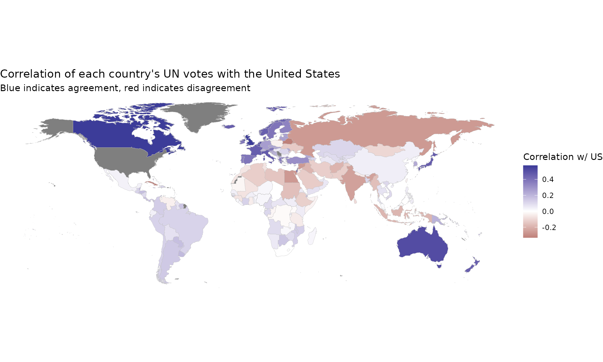
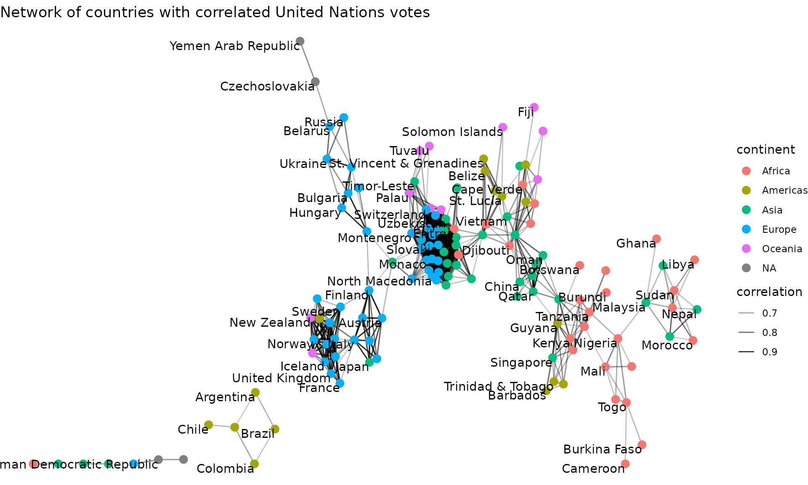

# United Nations Voting Correlations

Here we’ll examine an example application of the widyr package,
particularly the `pairwise_cor` and `pairwise_dist` functions. We’ll use
the data on United Nations General Assembly voting from the `unvotes`
package:

``` r
library(dplyr)
library(unvotes)

un_votes
```

    ## # A tibble: 869,937 × 4
    ##     rcid country            country_code vote 
    ##    <dbl> <chr>              <chr>        <fct>
    ##  1     3 United States      US           yes  
    ##  2     3 Canada             CA           no   
    ##  3     3 Cuba               CU           yes  
    ##  4     3 Haiti              HT           yes  
    ##  5     3 Dominican Republic DO           yes  
    ##  6     3 Mexico             MX           yes  
    ##  7     3 Guatemala          GT           yes  
    ##  8     3 Honduras           HN           yes  
    ##  9     3 El Salvador        SV           yes  
    ## 10     3 Nicaragua          NI           yes  
    ## # ℹ 869,927 more rows

This dataset has one row for each country for each roll call vote. We’re
interested in finding pairs of countries that tended to vote similarly.

### Pairwise correlations

Notice that the `vote` column is a factor, with levels (in order) “yes”,
“abstain”, and “no”:

``` r
levels(un_votes$vote)
```

    ## [1] "yes"     "abstain" "no"

We may then be interested in obtaining a measure of country-to-country
agreement for each vote, using the `pairwise_cor` function.

``` r
library(widyr)

cors <- un_votes |>
  mutate(vote = as.numeric(vote)) |>
  pairwise_cor(country, rcid, vote, use = "pairwise.complete.obs", sort = TRUE)

cors
```

    ## # A tibble: 39,800 × 3
    ##    item1     item2     correlation
    ##    <chr>     <chr>           <dbl>
    ##  1 Slovakia  Czechia         0.989
    ##  2 Czechia   Slovakia        0.989
    ##  3 Lithuania Germany         0.978
    ##  4 Germany   Lithuania       0.978
    ##  5 Lithuania Estonia         0.975
    ##  6 Estonia   Lithuania       0.975
    ##  7 Lithuania Latvia          0.973
    ##  8 Latvia    Lithuania       0.973
    ##  9 Slovakia  Slovenia        0.972
    ## 10 Slovenia  Slovakia        0.972
    ## # ℹ 39,790 more rows

We could, for example, find the countries that the US is most and least
in agreement with:

``` r
US_cors <- cors |>
  filter(item1 == "United States")

# Most in agreement
US_cors
```

    ## # A tibble: 199 × 3
    ##    item1         item2          correlation
    ##    <chr>         <chr>                <dbl>
    ##  1 United States United Kingdom       0.575
    ##  2 United States Canada               0.570
    ##  3 United States Israel               0.546
    ##  4 United States Australia            0.514
    ##  5 United States Netherlands          0.513
    ##  6 United States Luxembourg           0.504
    ##  7 United States Belgium              0.498
    ##  8 United States Italy                0.470
    ##  9 United States Japan                0.462
    ## 10 United States France               0.459
    ## # ℹ 189 more rows

``` r
# Least in agreement
US_cors |>
  arrange(correlation)
```

    ## # A tibble: 199 × 3
    ##    item1         item2          correlation
    ##    <chr>         <chr>                <dbl>
    ##  1 United States Belarus             -0.331
    ##  2 United States Cuba                -0.313
    ##  3 United States Czechoslovakia      -0.275
    ##  4 United States Egypt               -0.262
    ##  5 United States Russia              -0.261
    ##  6 United States Syria               -0.261
    ##  7 United States India               -0.241
    ##  8 United States Afghanistan         -0.191
    ##  9 United States Iraq                -0.189
    ## 10 United States Indonesia           -0.188
    ## # ℹ 189 more rows

This can be particularly useful when visualized on a map.

``` r
if (require("maps", quietly = TRUE) &&
    require("fuzzyjoin", quietly = TRUE) &&
    require("countrycode", quietly = TRUE) &&
    require("ggplot2", quietly = TRUE)) {
  world_data <- map_data("world") |>
    regex_full_join(iso3166, by = c("region" = "mapname")) |>
    filter(region != "Antarctica")
  
  US_cors |>
    mutate(a2 = countrycode(item2, "country.name", "iso2c")) |>
    full_join(world_data, by = "a2") |>
    ggplot(aes(long, lat, group = group, fill = correlation)) +
    geom_polygon(color = "gray", size = .1) +
    scale_fill_gradient2() +
    coord_quickmap() +
    theme_void() +
    labs(title = "Correlation of each country's UN votes with the United States",
         subtitle = "Blue indicates agreement, red indicates disagreement",
         fill = "Correlation w/ US")
}
```



### Visualizing clusters in a network

Another useful kind of visualization is a network plot, which can be
created with Thomas Pedersen’s [ggraph
package](https://github.com/thomasp85/ggraph). We can filter for pairs
of countries with correlations above a particular threshold.

``` r
if (require("ggraph", quietly = TRUE) &&
    require("igraph", quietly = TRUE) &&
    require("countrycode", quietly = TRUE)) {
  cors_filtered <- cors |>
    filter(correlation > .6)
  
  continents <- tibble(country = unique(un_votes$country)) |>
    filter(country %in% cors_filtered$item1 |
             country %in% cors_filtered$item2) |>
    mutate(continent = countrycode(country, "country.name", "continent"))
  
  set.seed(2017)
  
  cors_filtered |>
    graph_from_data_frame(vertices = continents) |>
    ggraph() +
    geom_edge_link(aes(edge_alpha = correlation)) +
    geom_node_point(aes(color = continent), size = 3) +
    geom_node_text(aes(label = name), check_overlap = TRUE, vjust = 1, hjust = 1) +
    theme_void() +
    labs(title = "Network of countries with correlated United Nations votes")
}
```



Choosing the threshold for filtering correlations (or other measures of
similarity) typically requires some trial and error. Setting too high a
threshold will make a graph too sparse, while too low a threshold will
make a graph too crowded.
